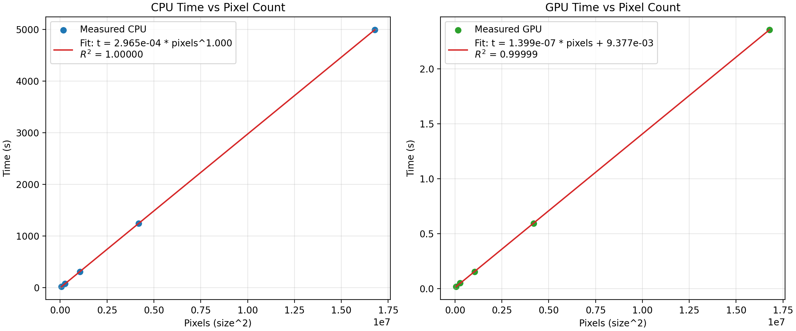

# Assignment 2: Lenia

Authors: Nejc Krajšek, Rok Mušič

## 1. Implementation

### 1.1 CUDA Parallelization Strategy

The core Lenia algorithm consists of two operations per timestep:

1. **2D Convolution**: Each cell's state is convolved with a 26×26 ring kernel using toroidal boundary conditions.
2. **Growth Update**: Cell values are updated based on a Gaussian growth function applied to the convolution result.

We parallelize both operations using per thread operations. We realize that both operations, convolution and growth update, could be implemented in the same kernel. However, due to cleaner implementation we decided to keep them separate. There might be small overhead due to having to launch more kernels, but we did not measure that and cannot me sure.

### 1.2 Memory Management and Transfer Optimization

We minimize host-device bandwidth by initializing the kernel and initial world state on host, transfer it to device once, perform all computation on device without exchanging any data between the host and device during computation, and transfer only the final world state back to host.

This approach reduces redundant transfers between host and device compared to per step transfers. Furthermore, there is no real reason to transfer any data during the computation back to host. For this reason, and since the requirements were to implement it as efficiently as possible, we did not separately benchmark the speedup gain compared to transferring data each time step.

The measured timings include all three components: `t_total = t_host_to_device + t_execution + t_device_to_host`.

### 1.3 Thread Block Optimization

To test how block sizes affect performance, we measured execution times for different configurations. Each block shape was run 5 times for every tested world size, and the table reports mean ± sample standard deviation in seconds. We expect 16x16 block size to be the best performing, due to its square shape matching the inherent 2D structure of the problem (and convolution operation).

| Grid Size | 8×32 | 16×16 | 32×8 | 32×16 | Best |
|-----------|------|-------|------|-------|------|
| 512×512   | 0.040 ± 0.000 | **0.027 ± 0.000** | 0.029 ± 0.000 | 0.029 ± 0.000 | 16×16 |
| 1024×1024 | 0.119 ± 0.000 | 0.094 ± 0.009 | 0.088 ± 0.001 | **0.088 ± 0.001** | 32×16 |
| 2048×2048 | 0.473 ± 0.000 | 0.353 ± 0.001 | 0.355 ± 0.001 | **0.352 ± 0.001** | 32×16 |
| 4096×4096 | 1.879 ± 0.003 | **1.419 ± 0.005** | 1.426 ± 0.004 | 1.423 ± 0.004 | 16×16 |

**Table 1: Measured GPU execution times for different thread block shapes, reported as mean ± sample standard deviation over 5 runs.**

The measurements do not show a single winner across all sizes: 16×16 is fastest for 512 and 4096, while 32×16 is slightly faster for 1024 and 2048. For the two larger balanced configurations, the differences are small.
We are not entirely sure why this happens, on one hand 32x16 has twice the number of threads as 16x16 and is a multiple of 32 which aligns well with the warp number of 32 on CUDA, while 16x16 is usually a good default (or so the LLM says) and potentially a better choice as it is square and it fits our 2D problem better.

However, as noted, the differences are extremely small, so the conclusions ought to be taken with a grain of salt. One notable point is that the 1024×1024 result for 16×16 has substantially higher variance than the other configurations, indicating more run-to-run noise.

8x32 performs worse in all cases, 32x8 the second worse in most cases (although by a much smaller margin than 8x32). This could indicate two things:

1. Square-ish shapes perform better than elongated ones.
2. For $A \times B$ shape it is better to have $A \ge B$. Since we only have one comparison, this is a far stretch, but we thought to mention it.

For the shared-vs-global memory comparison we used the 16×16 configuration.

### 1.4 Shared Memory Implementation

We implemented two GPU convolution modes:

- **GLOBAL**: baseline implementation. All reads are directly from global memory.
- **SHARED**: each thread block first loads an extended tile (including halo) into dynamic shared memory, then computes convolution from shared memory. The indices for accessing into global memory are linearly collapsed, each thread gets initial assignment offset by the halo, and we stride each thead by the total number of threads until all memory is read. This way we load, for each output value, its required neighborhood to perform convolution, and each world value is read from global memory only once (instead of multiple).

Both modes use identical update logic and differ only in convolution data access strategy. This allows direct speedup comparison for memory optimization.

## 2. Experimental Results

All measurements were made using 16x16 block size.

### 2.1 Performance Metrics

| Grid Size | CPU Time (s) | GPU Time (s) | Speedup |
|-----------|--------------|--------------|---------|
| 256×256   | 20.32        | 0.017        | 1196×   |
| 512×512   | 81.31        | 0.052        | 1565×   |
| 1024×1024 | 325.08       | 0.154        | 2105×   |
| 2048×2048 | 1300.87      | 0.605        | 2152×   |
| 4096×4096 | 5210.30      | 2.417        | 2156×   |

**Table 2: Average execution times and speedups.**

*Note: The time taken to transfer data to and from device is very small, for example `0.001172 s` for host $\rightarrow$ device @ 1024x1024.*

### 2.2 Speedup Analysis

Speedup grows from small to large grids, with diminishing returns as we get to larger sizes, already visible between 1024 and 2048, especially visible between 2048 and 4096 (from 2152× to 2156×). We tried to fit linear for GPU and power law for CPU times:

**Figure 1: Measured CPU and GPU execution times with fitted scaling curves.**

We observe that the relationship between the number of pixels and execution time grows linearly in both cases. The difference between the speedup is thus due to a proportionally much higher GPU overhead on images with lower pixel count (while it is amortized on larger ones). In other words, the speedup converges with bigger grid sizes.

### 2.3 Shared vs Global Memory

Using the same GPU setup (100 steps, same grid sizes), we benchmarked convolution with global-memory reads versus shared-memory tiling.

| Grid Size | Global Avg (s) | Shared Avg (s) | Speedup (Global/Shared) |
|-----------|----------------|----------------|-------------------------|
| 256×256   | 0.016992       | 0.009588       | 1.772×                  |
| 512×512   | 0.050779       | 0.027361       | 1.856×                  |
| 1024×1024 | 0.154643       | 0.087660       | 1.764×                  |
| 2048×2048 | 0.594342       | 0.354649       | 1.676×                  |
| 4096×4096 | 2.368430       | 1.413549       | 1.676×                  |

**Table 3: Shared-memory speedup over global-memory baseline (16×16 block).**

The shared-memory version is consistently faster for all tested sizes, with roughly the same amount of speedup (at around 1.7x speedup).

## 3. Conclusions

1. GPU is orders of magnitude faster than CPU for this task. It showcases the insane advantages of using a GPU on inherently parallel problems.
2. The time per pixel is linear for both CPU and GPU. The speedup obtained with using GPU converges to ~2150x as the world size grows.
3. The choice of block size is not straightforward and does not have a single best value. We found 16x16 to perform well.
4. The benefit of using shared memory instead of global almost doubles the speedup.
